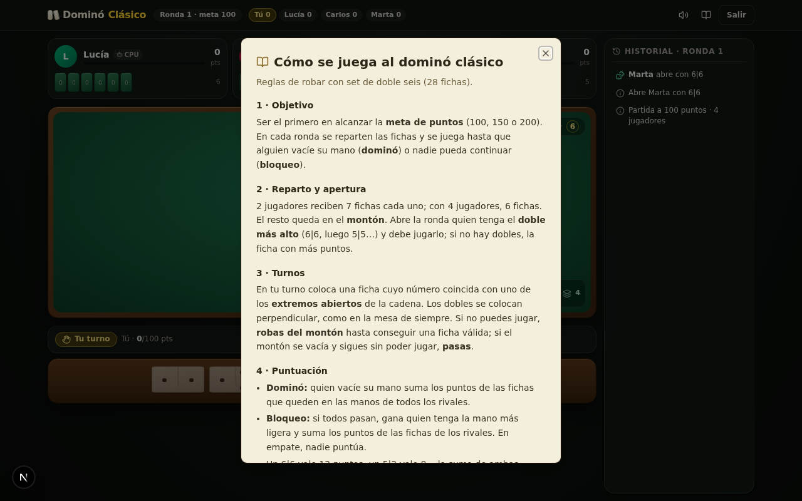
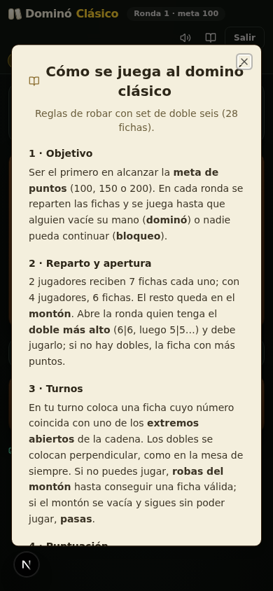

# Dominó Clásico

Webapp del juego de dominó clásico (estilo latino, con robo del montón), pensada para jugar directamente en el navegador contra la máquina o con amigos en el mismo dispositivo.



## Características

- **Set doble-seis completo**: las 28 fichas clásicas, barajadas al azar en cada ronda.
- **2 a 4 jugadores**: 1 humano contra 1, 2 o 3 rivales controlados por la CPU, o partidas locales compartiendo el dispositivo.
- **IA con 3 dificultades**:
  - *Fácil*: juega al azar.
  - *Normal*: prioriza descargar peso y los dobles.
  - *Difícil*: cuenta palos no vistos, administra la flexibilidad de su mano, controla los extremos de la mesa e infiere qué fichas les faltan a los rivales por sus pases y robos.
- **Reglas clásicas de robar**: apertura forzada por el doble más alto (o la ficha más pesada), robo del montón cuando no se puede jugar y pase solo cuando el montón está vacío.
- **Puntuación por rondas**: el ganador suma los puntos de las fichas restantes de sus rivales; partida a 100, 150 o 200 puntos configurables.
- **Detección de bloqueo (tranca)**: cuando nadie puede jugar, gana quien menos puntos tenga en la mano.
- **Interfaz cuidada**: mesa de fieltro verde con marco de madera, fichas de marfil, animaciones fluidas, historial de jugadas, sonidos sintetizados (sin archivos de audio) y diseño responsive para escritorio y móvil.



## Tecnologías

- [Next.js 16](https://nextjs.org) (App Router)
- [React 19](https://react.dev) + [TypeScript](https://www.typescriptlang.org)
- [Tailwind CSS 4](https://tailwindcss.com) + [shadcn/ui](https://ui.shadcn.com)
- [Framer Motion](https://www.motion.dev) para animaciones
- Web Audio API para efectos de sonido
- Estado del juego con un reducer puro (`useReducer`), sin dependencias externas

La lógica del dominó está aislada del interfaz y es completamente testeable:

```
src/lib/domino/engine.ts   # reglas puras: reparto, jugadas válidas, bloqueo, puntuación
src/lib/domino/ai.ts       # decisión de la CPU según dificultad
src/lib/domino/types.ts    # tipos del dominó
src/hooks/use-domino-game.ts  # reducer + turnos automáticos de la CPU
src/components/domino/        # interfaz (mesa, mano, paneles, diálogos)
```

## Desarrollo local

Requisitos: [Node.js 20+](https://nodejs.org) o [Bun](https://bun.sh).

```bash
bun install     # o: npm install
bun run dev     # o: npm run dev
```

Abre <http://localhost:3000> en el navegador.

Build de producción:

```bash
bun run build   # o: npm run build
bun run start   # o: npm run start
```

## Despliegue en Vercel

[](https://vercel.com/new/clone?repository-url=https://github.com/mediadigital-ai/2mino)

El proyecto es una aplicación Next.js estándar y se despliega en Vercel sin configuración adicional:

1. Entra a [vercel.com/new](https://vercel.com/new) con tu cuenta de GitHub.
2. Importa el repositorio `2mino`.
3. Vercel detecta Next.js automáticamente; pulsa **Deploy**.

No se necesitan variables de entorno: toda la persistencia (ajustes y estadísticas) se guarda en el `localStorage` del navegador.
